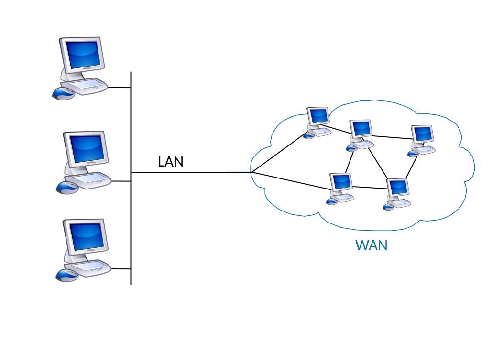
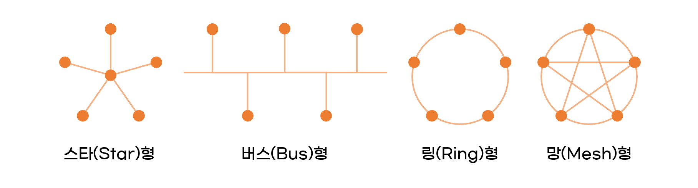

# 0. 네트워크란 무엇인가
{: .no_toc }

## TABLE OF CONTENTS
{: .no_toc .text-delta }

1. TOC
{:toc}

---
# Network?
컴퓨터 또는 통신 장비(노드)들이 데이터를 공유할 수 있게 하는 디지털 전기**통신망**의 하나이다.  
여러개의 시스템이 연결되어 있는 **통신망**.  
전 세계가 연결되어 있는 네트워크 = **인터넷**  

# Internet?
문서, 그림, 영상과 같은 여러가지 데이터를 **공유**하도록 구성된 세상에서 가장 큰 전세계를 연결하는 **네트워크**  
인터넷을 통해 웹 서비스를 이용할 수 있다(www)

# 네트워크의 분류
## 크기에 따른 분류
* Local Area Network(LAN)
  * 가까운 지역을 하나로 묶은 네트워크(같은 피씨방 내)
  * 강의장 내의 컴퓨터들은 하나의 스위치(네트워크 장비)에 다같이 랜선으로 연결되어 있다.
* Wide Area Network(WAN)
  * 멀리 있는 지역을 한데 묶은 네트워크. LAN끼리 묶은 것.
    

## 연결 형태에 따른 분류(토폴로지)

* Star 형
  * 중앙 장비에 모든 노드가 연결됨
  * 일반적으로 가정집에서는 공유기를 통해서 다양한 기기가 연결된다.
  * 장점: 결함 허용능력 제공, 중앙 집중식으로 관리 가능, 확장과 관리 편함
  * 단점: 중앙 네트워크 장비가 고장난다면 연결된 모든 기기가 먹통이 된다.
* Bus 형
  * 가장 간단하며 단일 케이블에 의해 네트워크의 모든 컴퓨터에 연결
  * 장점: 트레픽 제어 간단, 비용 저렴, 확장이 쉬움
  * 단점: 노드수가 증가하면 충돌증가로 통신효율 절감, 문제 발생한 곳 찾기 어려움, 버스 고장시 전체 다운
* Ring 형
  * 고리 구조를 형성하는 케이블에 컴퓨터를 연결한 형태
  * 장점: 데이터를 안정적으로 전송 ( 통신 효율이 좋다 ), 병목현상 발생 안함, 각 컴퓨터의 리피터와 같은 역할로 신호변질이 적어 질좋은 통신 제공
  * 단점: 한 노드의 고장은 전체 고장, 네트워크 확장과 구조변경이 어려움
* Mesh 형
  * 여러 노드들이 서로 그물처럼 연결됨
  * WAN 대역(서로 떨어져 있는 대역)을 연결할 때 사용함
  * 인터넷.
  * 장점: 결함허용 능력이 뛰어나다.
  * 단점: 설치관리가 어렵고, 케이블이 많이 필요해서 비용이 많이 든다.
* 혼합형
  * 실제 인터넷은 여러 형태를 혼합한 형태
  * LAN + WAN

# 네트워크의 통신 방식
* 유니 캐스트
  * 특정 대상이랑만 1:1 통신
* 멀티 캐스트
  * 특정 다수와 1:N으로 통신
* 브로드 캐스트
  * 네트워크에 있는 모든 대상과 통신

# 네트워크 프로토콜
## 프로토콜
  * 일종의 약속, 양식
  * 노드와 노드가 통신할 때 어떤 노드가 어느 노드에게 어떤 데이터를 어떻게 보내는지 작성하기 위한 양식(택배 송장)
  * 각 프로토콜마다 각 프로토콜만의 양식이 있다
## 프로토콜의 종류
* 가까운 곳과 연락할 때: Ethernet 프로토콜(MAC 주소)
* 멀리 있는 곳과 연락할 때: ICMP, IPv4, ARP(IP 주소)
* 여러가지 프로그램으로 연락할 때: TCP, UDP(포트 번호)

# 실습
1. cmd 창에 `tracert 8.8.8.8` 입력
    * trace route라는 프로그램을 실행하는 것. 네트워크 길목을 추적한다.
    * dns.google [8.8.8.8]으로 가는 경로 추적하는 명령어
    * 구글 dns 서버와 통신하기 위해 거쳐간 네트워크 LAN 대역이 나온다.