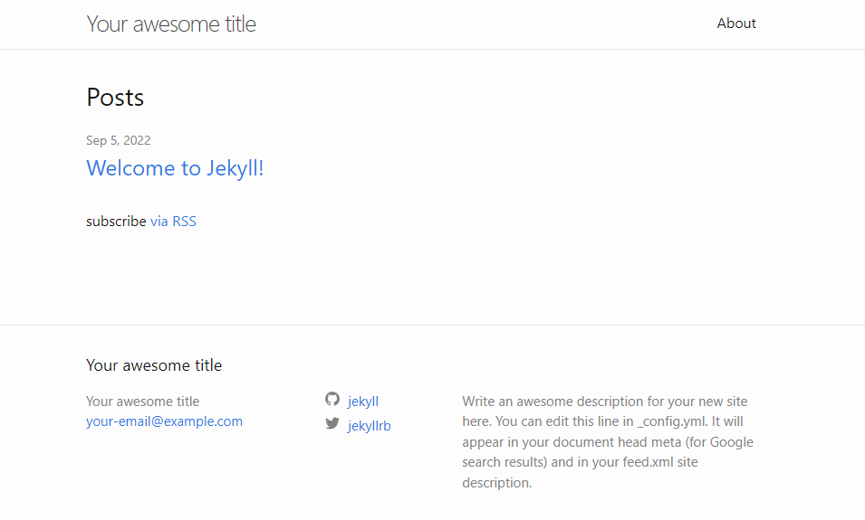

# github.io 블로그 시작하기
{: .no_toc }

## Table of contents
{: .no_toc .text-delta }

1. TOC
{:toc}

---
## Ruby, Jekyll 설치하기
깃허브 블로그를 운영할 때 직접 html css로 자신의 웹사이트를 만들 수도 있지만 [jekyll](https://jekyllrb.com/)을 이용해서 다양하게 꾸밀 수 있다. 지킬은 루비를 기반으로 하고 있기 때문에 루비를 깔아야 한다.

1. 루비 설치
    * [루비 홈페이지](https://rubyinstaller.org/downloads/)에서 최신 버전 Ruby를 다운로드한다.
    * 중간에 ‘PATH에 추가하시겠습니까?’ 부분은 반드시 체크
    * 다운로드 완료되면 cmd 창이 뜨는데 잘 모르겠으니 `ENTER` 누르기

2. Jekyll 설치
    * `win`+`R` 누르고 `cmd`입력해서 cmd 창 띄우기
    * Jekyll과 Bundler젬 설치  
        ```
        $ gem install jekyll bundler
        ```
    * 루비 3.0 이후부터 gem에 webrick이 포함되지 않기 때문에 webrick도 따로 설치  
        ```
        $ bundle add webrick
        ```

## 테스트 사이트 만들어보기
1. 로컬디스크(`C:`)에 테스트 폴더 `test` 만들고 cmd창에서 이동하기
    ```
    $ cd c:\ 
    $ mkdir test 
    $ cd test
    ```
2. 새 사이트 생성  
    ```
    $ jekyll new myblog
    ```
3. 생성된 디렉토리로 이동해서 사이트를 빌드하고 서버에 적용
    ```
    $ bundle exec jekyll serve
    ```
4. 브라우저에서 [서버](http://localhost:4000/) 접속  
    `http://localhost:4000/`
5. 다음 화면이 보이면 성공!


## 나만의 깃허브 블로그 만들기
1. 먼저 로컬에 위에서 만들었던 사이트의 토대를 만들 것이다. 원하는 폴더에서 새로운 사이트를 생성한다. 사이트 이름은 `<github username>.github.io`으로 할 것이다. 자신의 username이 manchott이라면 `manchott.github.io`로 만드는 것이다!
    ```
    $ jekyll new <github username>.github.io
    ```
2. 새로 만들어진 폴더(`<github username>.github.io`)에서 `shift`+`오른쪽 마우스 클릭`을 하면 **여기서 명령창 열기**가 생기는데 클릭하면 해당 폴더에서 cmd 창이 열린다.

깃허브에서 새로운 repository를 만든다. repo 이름은 `<github username>.github.io`로 한다.
    * 예를 들어 
    * 깃허브에서 자신의 username으로 시작되는 repo는 뭔가 특별한 레포라고 한다.
2. 

## 테마 찾기

* 원하는 블로그 테마 찾기 
    * [깔끔한 사이트](https://jekyllthemes.io/free)
    * [설명을 포함해서 정리한 사이트](https://jekyllthemes.dev/)
    * [무료 테마 사이트](https://jekyll-themes.com/free/)
    * [위랑 비슷한 사이트](http://themes.jekyllrc.org/)  
    [출처](https://wiznxt.tistory.com/677)


## 참고한 사이트
* [jekyll 공식 사이트](https://jekyllrb.com/)
* https://dataitgirls2.github.io/tutorial/Tutorial_180709_StaticBlogging_JekyllandRuby.html
* https://velog.io/@minji-o-j/jekyll-%EC%98%A4%EB%A5%98-%ED%95%B4%EA%B2%B0
* https://nasir17git.github.io/
* 