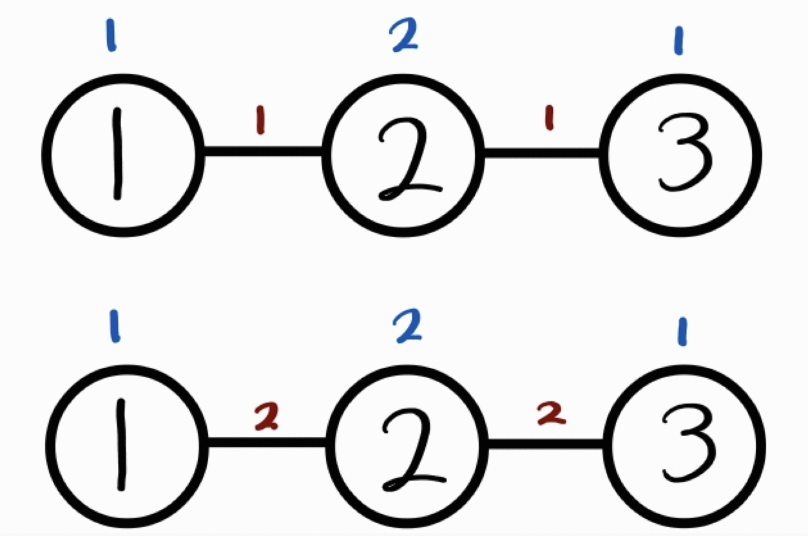

# 2022.12.03 카카오 모빌리티 2차 코딩 테스트
{: .no_toc }

## TABLE OF CONTENTS
{: .no_toc .text-delta }

1. TOC
{:toc}

---

## 카카오 모빌리티 2023 신입 개발자 공채 2차 코딩테스트
* 일시: 2022.12.03 14:00~17:00  
* 플랫폼: 프로그래머스
* 사용 언어: Python
* 문제 수: 코딩 2개, CS 20개
* 특이점: 모니토앱을 이용한 온라인 감독

너무나 쉬웠던 1차를 어떻게 걸렀는지는 모르겠지만 다행히도 나는 붙어서 2차 테스트까지 보게 되었다.  
다만 평소에 CS 공부를 거의 하지 않았기에 면접까진 바라지도 않고... 그냥 경험을 위해 코테를 보았다.  
모니토앱을 이용해 모니터와 얼굴이 보이도록 하고 코딩하는 화면을 화면공유까지 하는 빡빡한 시험이었다. 첫 공지에서는 중간에 화장실 이용 가능이랬는데 다음 공지에서는 화장실 이용도 금지시켰다... 3시간동안 화장실을 참아야했다,,,

## 1번 문제: 백트래킹(1시간)
여러 구간을 지나가야 하는데 자동차, 자전거, 대중교통, 도보로 지나갈 수 있다. 자동자를 선택했으면 모든 구간을 자동차로 지나가야하고, 자전거는 중간에 도보를 이용해도 된다. 대중교통 또한 도보를 이용할 수 있지만 대중교통을 이용하지 못하는 구간도 있다. 도보로 갈 때는 연속으로 걸을 수 있는 시간에 제한이 있어서 그 이상의 시간은 걸을 수 없다.

백트래킹을 해가며 자전거, 대중교통의 최단시간을 구하는 것이 쟁점이었던 것 같다.  
그러나... 나는 알고리즘을 안 푼지 너무 오래되어서 감을 잃은 바람에,,, dfs로 무지성 완탐을 해버렸다... n=20000이기 때문에 완탐을 해버렸으니 무조건 시간초과가 나지 않았을까.  
그래도 zip을 이용해 각 수단을 묶고, 각 수단별 최단 시간을 각각 구한 뒤 마지막에 비교를 했다. 이정도 한 것도 선방한듯...  
시험이 끝난 뒤 친구와 문제를 복기해보니 평소에도 알고리즘을 연습해야했다는 후회가 밀려왔다.

## 2번 문제: 그래프 탐색(1시간+, 못풀음) 
2개의 바이크 정류장을 만들 것인데, 최대한 많은 이용자가 이용할 수 있도록 해야한다. n개의 노드와 가중치 있는 엣지가 주어지고 각 노드별 이용자 수가 주어진다. 이용자가 이동할 수 있는 최대 길이 d와 각 정류장이 최대로 수용할 수 있는 수용자 m이 주어진다.   

d=1, m=2일 때, 1번의 경우는 어디든 2개의 정류장을 설치하면 최대 4명의 이용자가 정류장을 사용할 수 있다.  
2번의 경우 2번 노드에 정류장을 무조건 설치하고, 남은 하나는 아무 노드에 설치하면 최대 3명의 이용자가 정류장을 사용할 수 있다.  
  
문제는 이해가 되는데 도저히 코드를 어떻게 짜야할지 전혀 감이 오지 않았다....  결국 한시간 넘게 끙끙대다 못풀고 제출을 하게 되었다. 이 문제에 머리 쓰지 말고 1번 문제를 더 검토할걸 그랬다. 물론 그랬어도 내가 백트래킹을 생각해냈을 것 같진 않지만......

## CS 20문제 객관식(거의 다 찍음)
기억나는 문제와 이면지에 적어놨던 문제들을 정리해보면...
* SQL: UNIQUE INDEX
* 자료구조: 트리(후위 순회, 다원탐색트리), 스택, 그래프(DFS), 힙(Max-heap)
* 알고리즘: 알고리즘별 특징(최소 신장 트리, 다익스트라, 크루스칼 알고리즘, 프림 알고리즘, 벨만-포드 알고리즘) 
* 네트워크: TCP, DHCP, 라우팅(Distance Vector), 네트워크 계층
* 운영체제: 리눅스 동기화 기법, pthread_mutex_lock 함수, 세마포어
CS는 자료구조, 알고리즘 외에 네트워크 조금 찍먹해본게 다라서 80퍼센트는 찍었다. 객관식이라서 찍을수라도 있어서 천만 다행이었다. 모두 고르시오 문제도 있었고 그 중 부분점수 있는 문제도 있었다.  

## 후기
1차가 쉬웠던 만큼 2차는 어려울 것이라 예상했는데 예상대로 어렵게 나왔다. 그래 이정도는 되어야 변별력이 있지... 앞으로 알고리즘도 꾸준히 하고 CS도 놓치지 말아야겠다. 