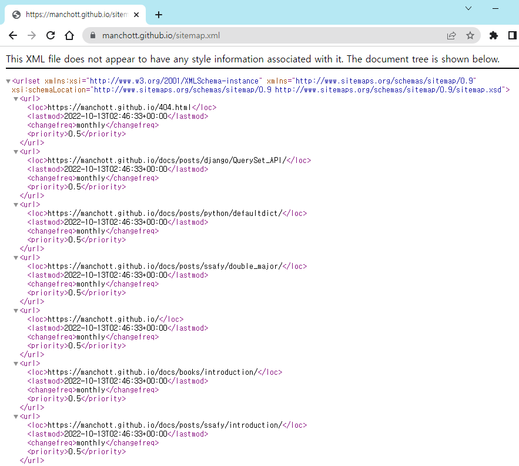
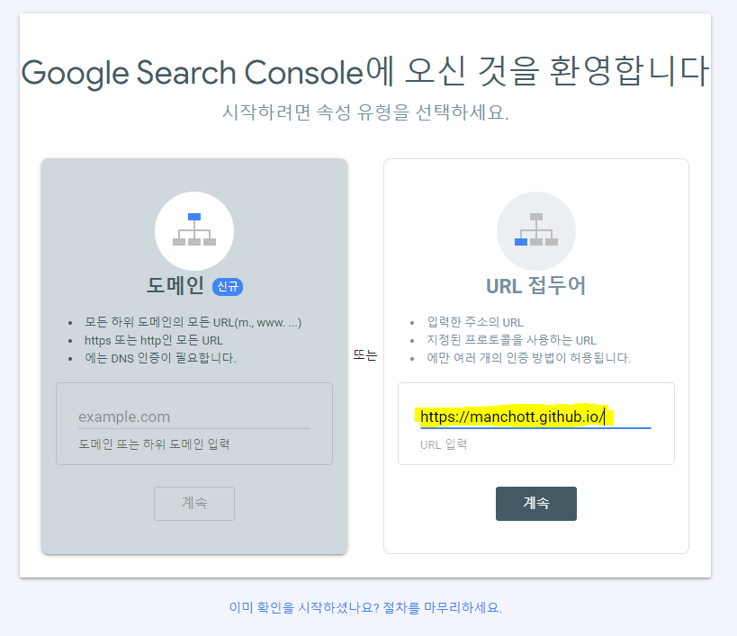
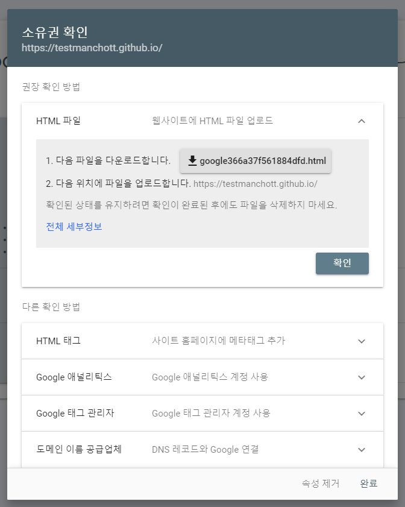
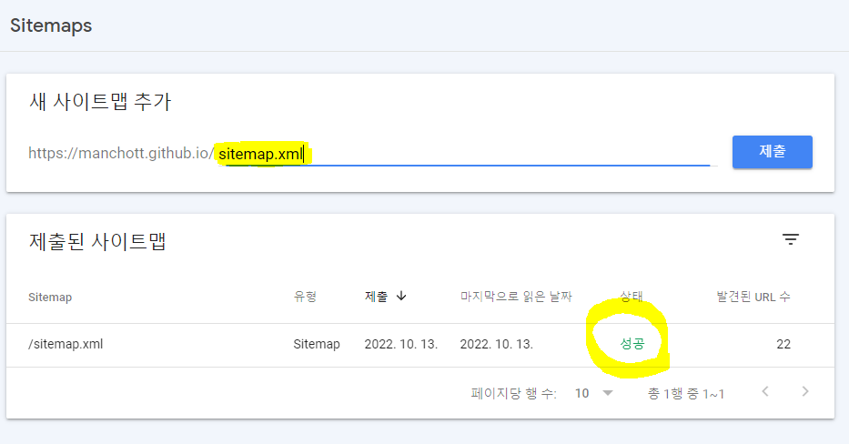
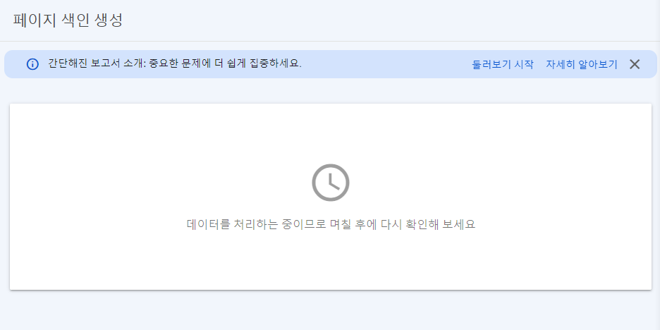

# github blog, 특히 just-the-docs 검색 엔진에 등록하기
{: .no_toc }

## Table of contents
{: .no_toc .text-delta }

1. TOC
{:toc}

---
## github는 기본적으로 검색 엔진에 걸리지 않도록 되어 있다.
그래서 따로 설정을 해줘야 한다.  
귀찮지만 간단하다.  
...라고 들었는데 내 블로그는 왜 적용이 안되는지 모르겠다... 조금 더 기다려야 하나보다. (2022-10-13)


## sitemap.xml 작성
내 사이트의 글을 모아놓은 지도(sitemap)을 작성하기 위한 파일이다. 똑똑한 사람들이 코드를 통해 자동으로 생성되게 만들어놓았다.  
본인 블로그의 root directory, 즉 최상위 폴더에 `sitemap.xml` 파일을 만들고 아래의 코드를 작성한다. 나의 경우, `manchott.github.io` 폴더 안에 파일을 만들었다.  

---  

github blog에 글을 쓸 때 `_posts` 폴더 안에 글을 쓰고, 제목을 `YYYY-MM-DD-title.md` 유형으로 작성하는 블로그라면 아래의 코드를 복붙하면 된다.

```
---
layout: null
---
<?xml version="1.0" encoding="UTF-8"?>
<urlset xmlns:xsi="http://www.w3.org/2001/XMLSchema-instance" xsi:schemaLocation="http://www.sitemaps.org/schemas/sitemap/0.9 http://www.sitemaps.org/schemas/sitemap/0.9/sitemap.xsd" xmlns="http://www.sitemaps.org/schemas/sitemap/0.9">
  
    <url>
      <loc>{{ site.url }}{{ post.url }}</loc>
      
        <lastmod>{{ post.date | date_to_xmlschema }}</lastmod>
      
        <lastmod>{{ post.lastmod | date_to_xmlschema }}</lastmod>
      

      
        <changefreq>weekly</changefreq>
      
        <changefreq>{{ post.sitemap.changefreq }}</changefreq>
      

      
          <priority>0.5</priority>
      
        <priority>{{ post.sitemap.priority }}</priority>
      

    </url>
  
</urlset>
```



<details>
<summary>하지만 만약 내가 just-the-docs를 블로그 테마로 쓴다면...?</summary>
<div markdown="1">

혹시라도 일반 블로그 사용자가 헷갈릴까봐 just-the-docs 사용자를 위해 토글로 만들었다...  
just-the-docs는 다른 블로그 테마와는 다르게 `_posts`가 아닌 `docs` 폴더에 글을 작성한다. 심지어 제목에 날짜도 작성하지 않아도 된다.  
그래서 그런지 인터넷에 널리 퍼져있는 위의 코드가 작동하질 않는다. site.posts에 저장되어 있는 블로그의 post를 긁어와야 하는데 `docs`에 글을 쓰기 때문에 아무것도 긁어오질 않는다!!!!  
  
해결을 위해 시도해본 방법들:  
1. 그냥 sitemap.xml을 자동 생성해주는 [페이지](https://www.xml-sitemaps.com/)를 이용하기  
위의 사이트에서 sitemap을 생성해봤는데 이 방법을 사용할 경우 글을 하나 쓸 때마다 새로 작성을 해야하는데 말도 안된다. 너무 귀찮다!

2. just-the-docs 테마를 뜯어 고치기  
그렇다면 내가 이 테마를 고쳐서 `_posts`에 글을 작성하게 바꾸면 되지 않을까?  
**안 된다.**  
테마 이름에서부터 just the docs 이러고 있으니 `docs` 폴더 안에 글을 써서 넣어야지만 왼쪽 navbar에도 이쁘게 나온다. 물론 `_posts`에 쓴 글을 긁어오는 [블로그](https://tech.fog.fish/)도 있던데 내가 원하던 방법이 아니다!!! 이 사람은 그냥 글을 한 페이지에 때려넣었던데 나는 분류별로 볼 수 있는 지금의 내 테마가 너무 좋다...  
3. 테마 바꾸기  
포기하고 테마를 바꿀까 고민했지만 just the docs는 내가 너무 바라던 블로그 형식이라 포기 할 수 없었다....... 그래서 몇날며칠을 검색하다가 해결책을 찾았다!!!!
4. 다른 just-the-docs 블로그가 어떻게 sitemap을 작성했는지 염탐하기  
검색해보니 [이 글](https://github.com/just-the-docs/just-the-docs/discussions/763)이 나왔다. 이 분은 sitemap.xml이 잘 뜨는데 구글 서치 콘솔이 잘 안나오나 보다. 나는 애초에 sitemap 조차 안나왔기 때문에 이 분의 블로그 == 나의 해결책임을 직감했다!!!!  
그래서 이 분의 [github](https://github.com/meansoup/meansoup.github.io/blob/master/sitemap.xml)에 가서 sitemap.xml을 긁어왔다!!!! 감사합니다... 감사합니다.... 직접 작성하셨는지 어디서 가져오셨는지 모르겠지만 감사합니다...  


```
---
layout: null
---
<?xml version="1.0" encoding="UTF-8"?>
<urlset xmlns:xsi="http://www.w3.org/2001/XMLSchema-instance"
        xsi:schemaLocation="http://www.sitemaps.org/schemas/sitemap/0.9 http://www.sitemaps.org/schemas/sitemap/0.9/sitemap.xsd"
        xmlns="http://www.sitemaps.org/schemas/sitemap/0.9">
  
    
    <url>
      <loc>{{ site.url }}{{ page.url | remove: "index.html" }}</loc>
      
        <lastmod>{{ page.sitemap.lastmod | date: "%Y-%m-%d" }}</lastmod>
      
        <lastmod>{{ page.date | date_to_xmlschema }}</lastmod>
      
        <lastmod>{{ site.time | date_to_xmlschema }}</lastmod>
      
      
        <changefreq>{{ page.sitemap.changefreq }}</changefreq>
      
        <changefreq>monthly</changefreq>
      
      
        <priority>{{ page.sitemap.priority }}</priority>
      
        <priority>0.5</priority>
      
    </url>
    
  
</urlset>
```


코드를 좀 보니 이 분은 site.posts가 아닌 site.pages를 사용하셨다. just-the-docs는 posts가 아니라 pages를 사용해야 하나보다. 이거 하나 몰라서 며칠을 고생했는지 모르겠다ㅠㅠㅠㅠ 그래도 다행히 해결되었고 sitemap.xml은 물론 나는 구글 서치 콘솔에도 잘 나오더라.


</div>
</details>
## robots.txt 생성
검색엔진의 크롤러가 원활하게 내 블로그 글을 크롤링 할 수 있도록 robot을 만든다. 이 파일도 root directory에 만들고 아래의 코드를 작성한다.  
`Sitemap: `에 해당하는 url은 \<자신의 블로그 주소\>/sitemap.xml로 작성한다.

```
User-agent: *
Allow: /

Sitemap: http://manchott.github.io/sitemap.xml
```
## 사이트에 등록
1. Google  
   1. [Google Search Console](https://search.google.com/search-console/about)에 접속하고 시작하기를 누른다. 
   2. **url 접두어** 쪽에 본인 블로그 주소를 `http://`부터 쭉 긁어서 붙여넣는다.
   
   3. 소유권 확인을 위한 파일을 다운받고 `sitemap.xml`과 `robots.txt`를 넣은 곳인 root directory에 넣는다.  
   (이 블로그는 내가 이미 구글에 저장해서 테스트 블로그 이미지를 가져왔다.)
   
   4. github에 지금까지의 과정을 commit한다.
   5. github에 변경사항이 저장될 때까지 잠시 기다리고 내 블로그 주소 뒤에 sitemap.xml을 붙여서 sitemap이 잘 나오는지 확인한다.  
   잘 나오지 않는다면 뭔가 문제가 있는 것이다... 가령 나처럼 특이한 블로그 테마를 사용해서 sitemap.xml이 작동 안한다거나...
   
   6. 잘 작동한다면 콘솔에서 색인-sitemaps로 들어가서 sitemap.xml을 입력하고 제출하면 된다. 문제 없다면 상태가 성공으로 뜬다.
   
   7. 이 이후는.. 나도 아직 잘 모르겠다. sitemap을 등록한지 3일째인데 며칠 후에 확인해보라니 기다려야겠다.
   
