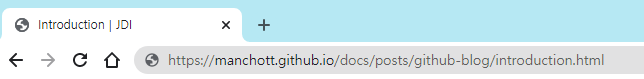

# github.io 블로그 시작하기
{: .no_toc }

## Table of contents
{: .no_toc .text-delta }

1. TOC
{:toc}

---
## 주소창 예쁘게 만들기
처음 Github 블로그를 시작하고 글을 쓰면 글 뒤에 `.html`이 붙는다.   
  
정말 마음에 안들고 예시 블로그는 잘만 나오는데 나는 왜이러는지 의문이었다.  
찾아보니 해결법은 매우 간단한데 `_config.yml` 파일에 `permalink: pretty`를 추가하면 된다.  
collection을 사용하는 방법도 있는 듯 한데 이는 나중에 알아볼 예정이다.