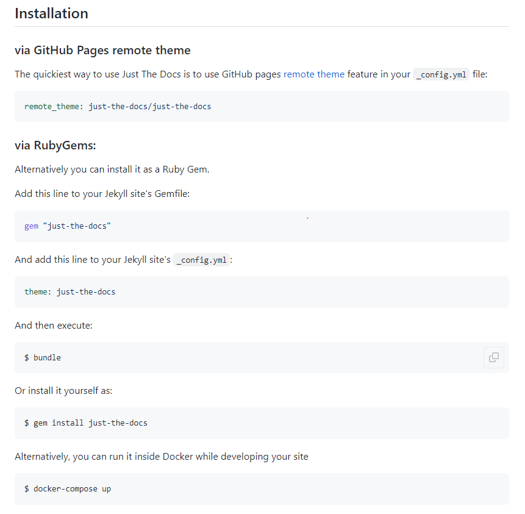
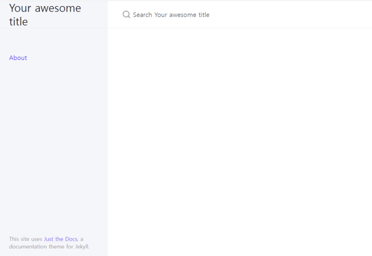

# 블로그에 글 쓰기
{: .no_toc }

## Table of contents
{: .no_toc .text-delta }

1. TOC
{:toc}

---

## 매번 기다릴 필요 없이 서버에서 페이지 구동 확인하기
* 터미널에 `bundle exec jekyll serve`를 입력하면 <http://localhost:4000/>에서 블로그 페이지가 어떻게 보이는지 확인할 수 있다. 매번 github에 commit하고 기다릴 필요가 없다!! 
* 만약 새빨간 에러글이 보이고 바로 아래에 `cannot load such file -- webrick (LoadError)`가 뜬다면 `bundle add webrick`을 통해 해결 가능하다.
* 로컬 서버에서 확인하는 것이기 때문에 내 블로그에 적용하고 싶으면 당연히 Github에 commit해야한다.

## 원하는 블로그 테마 찾기 
제일 중요한 단계나 다름 없다. 다양한 테마들이 있으니 꼼꼼히 찾아보자. 한번 정하고 커스텀 하면 바꾸기 어려울 테니...  
    * [깔끔한 사이트](https://jekyllthemes.io/free)  
    * [설명을 포함해서 정리한 사이트](https://jekyllthemes.dev/)  
    * [무료 테마 사이트](https://jekyll-themes.com/free/)  
    * [위랑 비슷한 사이트](http://themes.jekyllrc.org/)  

## 블로그 테마 입히기
1. 원하는 테마의 Github 페이지로 들어가면 Installation 가이드가 있을 것이다. 

2. 이 중 gem을 사용하는 방법을 이용할 것이다.  
`<github username>.github.io` 폴더 내의 `Gemfile` 파일에 `gem "minima"` 라고 쓰여있는 줄을 `gem "just-the-docs"`로 바꾼다.

3. `_config.yml`파일로 들어가 `theme: minima`라고 되어있는 부분을 `theme: just-the-docs`로 바꾼다.  
2번과 3번 과정은 default로 설정되어 있는 블로그 테마 minima를 내가 고른 테마로 바꾸는 것이다.

4. 해당 변경사항을 적용하기 위해 터미널에서 `bundle`을 실행한다.
5. 새로고침 해보면 테마 적용 완료!

## 참고한 사이트
* [just-the-docs](https://github.com/just-the-docs/just-the-docs)
* 블로그 테마 모음: <https://wiznxt.tistory.com/677>